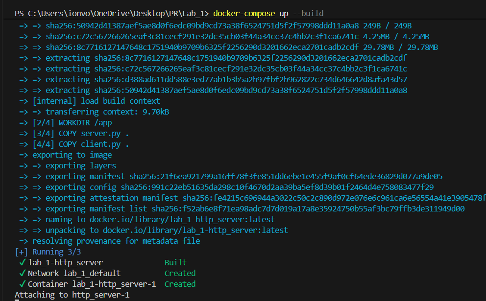
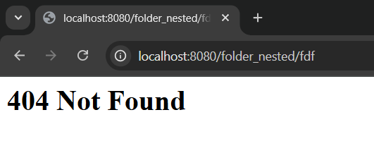
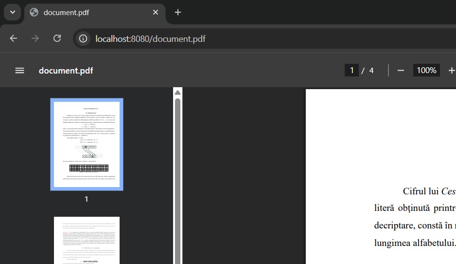
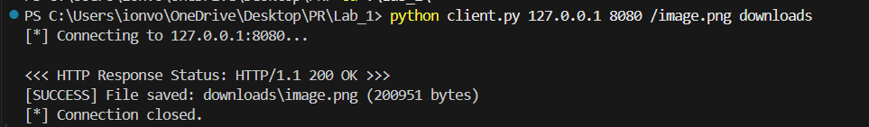
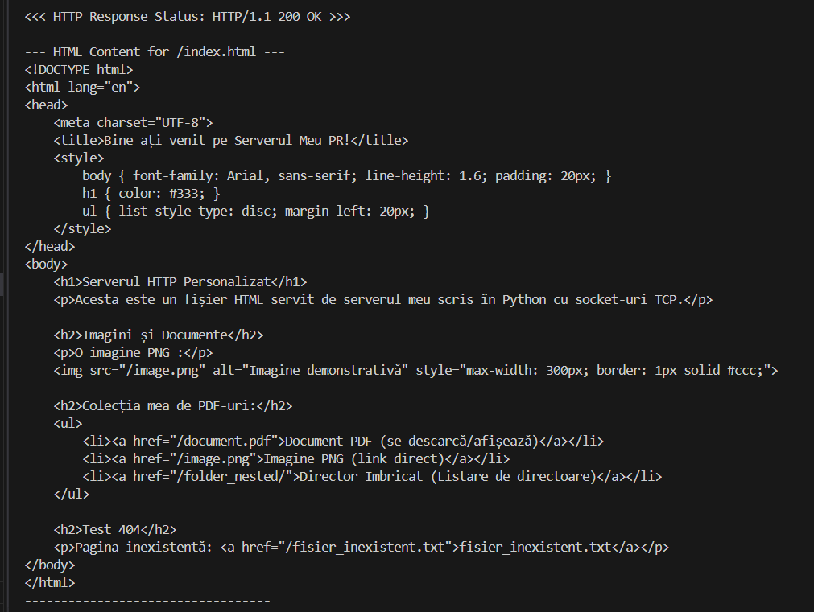
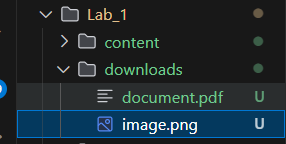
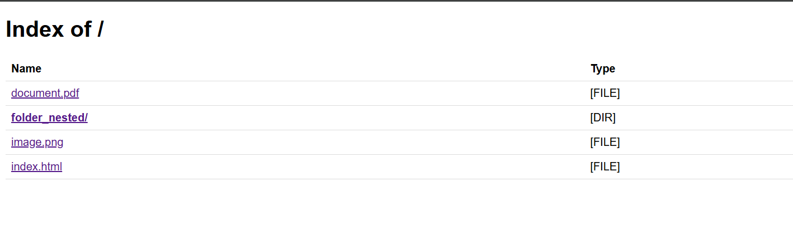
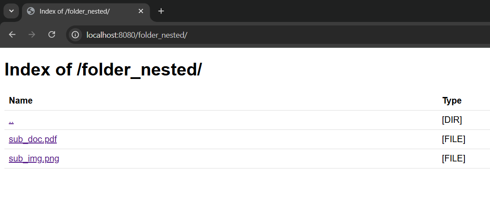

# HTTP Server Lab Report

## 1. Source Directory Contents

The project source directory contains the following files and structure:

Main files:

-   `server.py` - HTTP server implementation
-   `client.py` - HTTP client implementation
-   `Dockerfile` - Container image definition
-   `docker-compose.yml` - Docker Compose configuration
-   `readme.md` - Project documentation

The `content/` directory contains the files to be served:

-   `index.html` - Main HTML page
-   `image.png` - PNG image file
-   `document.pdf` - PDF document
-   `folder_nested/` - Subdirectory containing:
    -   `sub_doc.pdf` - Nested PDF file
    -   `sub_img.png` - Nested PNG image

## 2. Docker Configuration Files

### Dockerfile

```dockerfile
FROM python:3.10-slim

WORKDIR /app

COPY server.py .
COPY client.py .

EXPOSE 8080

CMD ["python", "server.py", "/app/content", "8080"]
```

### docker-compose.yml

```yaml
version: "3.8"

services:
    http_server:
        build: .

        hostname: pr-http-server

        ports:
            - "8080:8080"

        volumes:
            - ./content:/app/content

        command: python server.py /app/content 8080

        restart: unless-stopped
```

## 3. Starting the Container

To start the HTTP server container, use the following command:

```bash
docker-compose up --build
```



The server starts and listens on port 8080, serving files from the `/app/content` directory.

## 4. Server Command Inside Container

The server is started inside the container with the following command:

```bash
python server.py /app/content 8080
```

This command:

-   Runs the `server.py` script
-   Serves files from the `/app/content` directory
-   Listens on port 8080

**[Image: Screenshot of server startup logs]**

## 5. Contents of Served Directory

The served directory (`/app/content`) contains:

```
content/
├── index.html
├── image.png
├── document.pdf
└── folder_nested/
    ├── sub_doc.pdf
    └── sub_img.png
```

## 6. Browser Requests

### 6.1 Non-existent File (404 Error)

Request: `http://localhost:8080/nonexistent.html`


The server correctly returns a 404 status code with an appropriate error message.

### 6.2 HTML File with Image

Request: `http://localhost:8080/index.html`


The HTML page loads successfully, and any embedded images are displayed correctly.

### 6.3 PDF File

Request: `http://localhost:8080/document.pdf`



The PDF file is served with the correct MIME type (`application/pdf`) and renders properly in the browser.

### 6.4 PNG Image File

Request: `http://localhost:8080/image.png`


The PNG image is served with the correct MIME type (`image/png`) and displays correctly.

## 7. Client Implementation

### Running the Client

The HTTP client can be executed with the following command:

```bash
python client.py <server_host> <server_port> <url_path> <directory_to_save>
```

Example usage:

```bash
python client.py localhost 8080 /document.pdf ./downloads
```

### Client Output Examples

**Example 1: Downloading a PDF file**

```bash
python client.py localhost 8080 /document.pdf ./downloads
```


Output:

```
[*] Connecting to localhost:8080...

<<< HTTP Response Status: HTTP 200 OK >>>
[SUCCESS] File saved: ./downloads/document.pdf (XXXX bytes)
[*] Connection closed.
```

**Example 2: Downloading a PNG image**

```bash
python client.py localhost 8080 /image.png ./downloads
```


Output:

```
[*] Connecting to localhost:8080...

<<< HTTP Response Status: HTTP 200 OK >>>
[SUCCESS] File saved: ./downloads/image.png (XXXX bytes)
[*] Connection closed.
```

**Example 3: Requesting an HTML file**

```bash
python client.py localhost 8080 /index.html ./downloads
```


The client displays the HTML content in the terminal.

**Example 4: Requesting a non-existent file**

```bash
python client.py localhost 8080 /nonexistent.html ./downloads
```


Output:

```
[*] Connecting to localhost:8080...

<<< HTTP Response Status: HTTP 404 Not Found >>>

--- Response Body ---
<html><body><h1>404 Not Found</h1><p></p></body></html>
---------------------
[*] Connection closed.
```

### Saved Files

The downloaded files are saved in the specified directory:



## 8. Directory Listing Feature

### Root Directory Listing

Request: `http://localhost:8080/`



The server generates an HTML directory listing showing:

-   Parent directory link (..)
-   All files in the directory
-   Subdirectories (marked with [DIR])
-   Files (marked with [FILE])

### Subdirectory Listing

Request: `http://localhost:8080/folder_nested/`


The subdirectory listing displays:

-   Link to parent directory (..)
-   Files within the subdirectory (`sub_doc.pdf`, `sub_img.png`)
-   Appropriate file type indicators

## 9. Conclusion

The HTTP server successfully:

-   Serves static files with correct MIME types
-   Handles directory listings
-   Returns appropriate HTTP status codes (200, 404, etc.)
-   Runs in a Docker container with proper port mapping
-   Supports client requests for downloading files

The implementation demonstrates a functional HTTP server with directory browsing capabilities, proper error handling, and containerized deployment.
