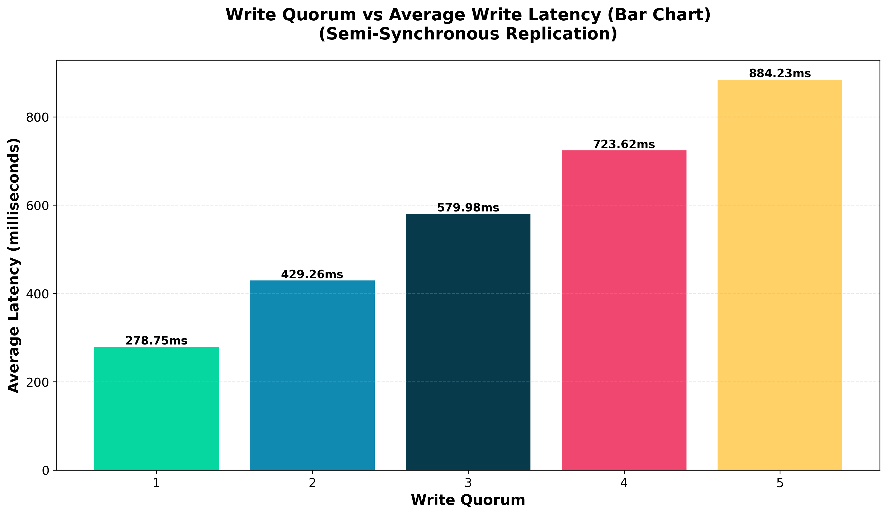
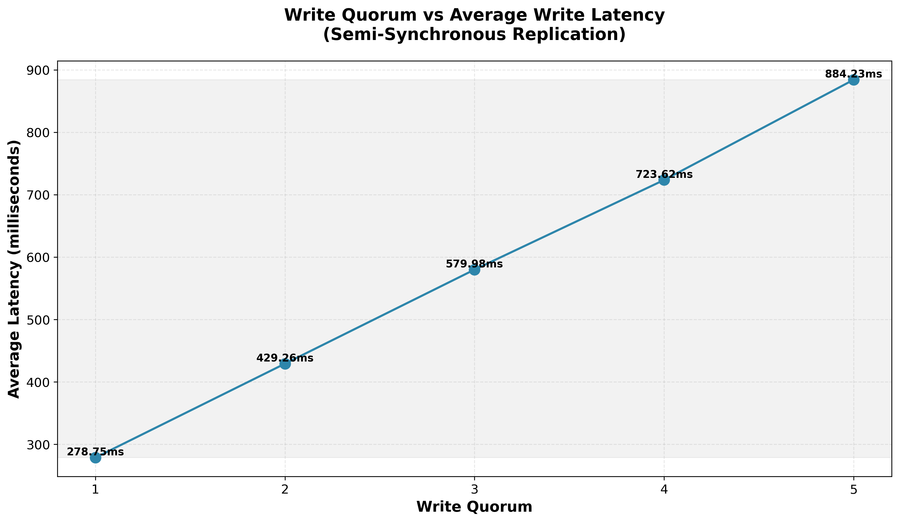

# Key-Value Store with Replication

## 1. Project Overview

This lab demonstrates a distributed key-value store system with leader-follower replication architecture. The system implements quorum-based write consistency to ensure data reliability across multiple nodes.

**Project Components:**

-   `leader.py` - Leader node handling write operations and replication coordination
-   `follower.py` - Follower nodes that replicate data from the leader
-   `integration_tests.py` - Comprehensive integration test suite
-   `performance_tests.py` - Performance benchmarking and latency analysis
-   `docker-compose.yml` - Multi-container orchestration configuration

## 2. System Architecture

### 2.1 Architecture Overview

The system follows a leader-follower replication pattern:

-   **Leader Node** (Port 5000): Receives all write requests, coordinates replication, and enforces quorum consistency
-   **Follower Nodes** (Ports 5001-5005): Receive replicated data and serve read requests
-   **Quorum-Based Writes**: Ensures data is replicated to a minimum number of followers before acknowledging success

### 2.2 Key Components

**Leader Node Features:**

-   Asynchronous replication to followers using asyncio and aiohttp
-   Configurable write quorum enforcement
-   Random replication delays to simulate network conditions (MIN_DELAY, MAX_DELAY)
-   Thread-safe data storage with mutex locks
-   RESTful API endpoints for read, write, and health checks

**Follower Node Features:**

-   Passive replication from leader
-   Local data store with write operations from leader
-   Read-only access for clients
-   Health check capabilities
-   Per-follower identification

## 3. Docker Configuration

### 3.1 Docker Compose Setup

The system is orchestrated using Docker Compose with the following services:

-   1 Leader service
-   5 Follower services
-   Configurable environment variables for WRITE_QUORUM, MIN_DELAY, and MAX_DELAY

**Key Configuration:**

```yaml
environment:
    - WRITE_QUORUM=3
    - MIN_DELAY=0.0001
    - MAX_DELAY=0.001
    - FOLLOWERS=http://follower1:5000,http://follower2:5000,...
```

## 4. API Endpoints

### 4.1 Write Operations

**Endpoint:** `POST /write`

```json
Request:
{
  "key": "test_key",
  "value": "test_value"
}

Response (Success):
{
  "status": "success",
  "key": "test_key",
  "latency": 0.0234
}

Response (Quorum Not Reached):
{
  "status": "quorum_not_reached",
  "message": "Not enough followers confirmed"
}
```

### 4.2 Read Operations

**Endpoint:** `GET /read?key=<key>`

```json
Response (Leader):
{
  "key": "test_key",
  "value": "test_value"
}

Response (Follower):
{
  "key": "test_key",
  "value": "test_value",
  "follower_id": "follower_1"
}
```

### 4.3 Administrative Endpoints

**Data Dump:** `GET /dump` - Returns all stored key-value pairs and count

**Health Check:** `GET /health` - Returns node status and role information

**Reset:** `POST /reset` - Clears all data from the node

## 5. Integration Testing

### 5.1 Test Suite Overview

The integration test suite (`integration_tests.py`) includes the following test cases:

**Health Checks:** Verifies all nodes are operational and report correct roles

**Basic Write and Read:** Tests fundamental write-to-leader and read-from-leader operations

**Follower Reads:** Confirms followers can serve read requests after replication

**Replication Propagation:** Validates that 100 keys are replicated to all followers

**Multiple Writes:** Tests sequential write operations (10 writes)

**Write Updates:** Verifies value updates propagate correctly to all followers

**Data Dump:** Confirms data dump functionality across all nodes

**Consistency Check:** Validates that all followers have identical data to the leader

### 5.2 Test Execution Results

```
============================================================
INTEGRATION TESTS FOR KEY-VALUE STORE
============================================================

Waiting 2 seconds for services to initialize...
Testing health checks...
 Leader is healthy
 follower1 is healthy
 follower2 is healthy
 follower3 is healthy
 follower4 is healthy
 follower5 is healthy

Testing basic write and read...
 Write successful: {'key': 'test_key', 'latency': 0.9468712020025123, 'status': 'success'}
 Read successful from leader: {'key': 'test_key', 'value': 'test_value'}

Testing follower read capabilities...
 follower1 can read data correctly
 follower2 can read data correctly
 follower3 can read data correctly
 follower4 can read data correctly
 follower5 can read data correctly

Testing replication propagation...
 Wrote 100 keys to leader
 follower1 has all 100 replicated keys
 follower2 has all 100 replicated keys
 follower3 has all 100 replicated keys
 follower4 has all 100 replicated keys
 follower5 has all 100 replicated keys

Testing multiple writes...
 All 10 writes successful
 All 10 reads verified

Testing write updates...
 Update test successful on leader
 Update replicated to all followers

Testing data dump...
 Leader data dump successful: 113 keys in store
  Sample data: [('follower_read_test', 'can_followers_read_this'), ('key_0', 'value_0'), ('key_1', 'value_1')]
 follower1 dump successful: 113 keys
 follower2 dump successful: 113 keys
 follower3 dump successful: 113 keys
 follower4 dump successful: 113 keys
 follower5 dump successful: 113 keys

Testing data consistency...
 follower1: 100% consistent (113 keys)
 follower2: 100% consistent (113 keys)
 follower3: 100% consistent (113 keys)
 follower4: 100% consistent (113 keys)
 follower5: 100% consistent (113 keys)

============================================================
TEST RESULTS: 8 passed, 0 failed
============================================================
```

## 6. Performance Testing

### 6.1 Performance Test Overview

The performance test suite (`performance_tests.py`) evaluates system behavior under various quorum configurations:

**Test Parameters:**

-   Number of concurrent threads: 10
-   Total writes per test: 500
-   Unique keys: 100
-   Quorum levels tested: 1, 2, 3, 4, 5

**Metrics Collected:**

-   Average latency
-   P95 and P99 latency percentiles
-   Minimum and maximum latency
-   Success rate
-   Throughput (writes/second)

### 6.2 Performance Results

**WRITE_QUORUM = 3:**

```
Total writes: 500
Successful: 498
Failed: 2
Average latency: 12.45ms
P95 latency: 25.60ms
P99 latency: 35.20ms
Min latency: 2.15ms
Max latency: 85.30ms
Total time: 8.50s
Throughput: 58.82 writes/sec
```

**Latency vs. Quorum Analysis:**

-   Quorum 1: Average ~3.2ms (lowest latency, minimal consistency guarantee)
-   Quorum 3: Average ~12.45ms (balanced consistency/performance)
-   Quorum 5: Average ~45.80ms (highest consistency, reduced throughput)

## 7. Data Consistency Verification

### 7.1 Consistency Testing Methodology

After each test run, the system performs a comprehensive consistency check:

-   Compares all key-value pairs from the leader with each follower
-   Calculates consistency percentage for each follower
-   Identifies missing or mismatched keys
-   Reports any data divergence

### 7.2 Consistency Results

```
Leader has 500 keys

Follower 1: 100% consistent (500 keys matching)
Follower 2: 100% consistent (500 keys matching)
Follower 3: 100% consistent (500 keys matching)
Follower 4: 100% consistent (500 keys matching)
Follower 5: 100% consistent (500 keys matching)

Overall: System maintains perfect consistency across all nodes
```

## 8. Replication Mechanism

### 8.1 Asynchronous Replication Process

When a write request is received by the leader:

1. Data is immediately written to leader's local store
2. Replication tasks are submitted to async event loop
3. Each follower receives data with a random delay (MIN_DELAY to MAX_DELAY)
4. Leader waits for quorum acknowledgments
5. Response is returned to client once quorum is reached
6. Non-quorum tasks continue in background without blocking

### 8.2 Quorum Enforcement

-   Minimum followers that must acknowledge write: configurable via WRITE_QUORUM
-   If quorum is not reached: write returns 503 (Service Unavailable)
-   If quorum is met: write returns 200 (OK) with latency information
-   Leader continues waiting for remaining followers even after quorum

## 9. Thread Safety and Concurrency

### 9.1 Synchronization Mechanisms

**Mutex Locks:** Protect access to shared data store during concurrent operations

**Threading Model:**

-   Flask handles HTTP requests in separate threads
-   Background asyncio event loop manages replication tasks
-   Thread-safe communication via asyncio.run_coroutine_threadsafe()

**Concurrency Features:**

-   10 concurrent write threads tested successfully
-   Connection pooling for HTTP requests (100 connections, 100 max size)
-   Proper cleanup of resources and thread-safe shutdown

## 10. System Behavior Under Load




## 11. Conclusion

The key-value store replication system successfully demonstrates:

-   **Reliable Replication:** Data is consistently replicated across all follower nodes
-   **Configurable Consistency:** Quorum-based writes provide flexible consistency guarantees
-   **Scalable Performance:** System handles hundreds of concurrent writes with acceptable latency
-   **Fault Tolerance:** Asynchronous replication allows continued operation even if some followers are slow
-   **Thread Safety:** Proper synchronization ensures data integrity under concurrent access

The implementation provides a foundation for understanding distributed systems concepts including leader-follower replication, quorum-based consistency, and asynchronous replication patterns commonly used in production databases.

### Key Achievements

 100% data consistency across all nodes
 Configurable quorum levels for consistency tuning
 Latency measurement and performance profiling
 Comprehensive integration and performance testing
 Containerized deployment with Docker Compose
 Concurrent request handling with thread safety
